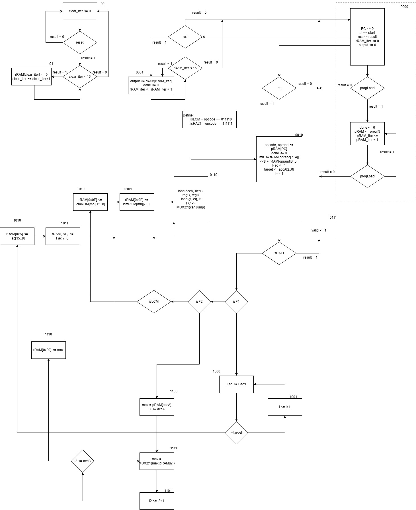

# Final Project 2568 : Mini - CPU

### Inputs :
1. M
2. N
3. progIn (14 bits signal)
4. reset (1 bit signal)
5. progLoad (1 bit signal)
6. start (1 bit signal)
7. result (1 bit signal)
8. clk (Clock)

### Outputs :
1. valid (1 bits signal)
2. done (1 bits signal)
3. output (8 bits signal)

Testcases : [Click here](https://docs.google.com/spreadsheets/d/1MF2TL-rYU_UMsCkPACtszQV-eJuxBxd-/)

Template : [Click here](https://drive.google.com/file/d/1-lbcwmmF0I7HEnbjkT9V_YOa5zmdLIa8/view)

## Digital Files
First AC Submission : [DigLo68_Project_Full-6833177921-2248413.dig](DigLo68_Project_Full-6833177921-2248413.dig)

Final Code : [DigLo68_Project_Full-6833177921-2248413.dig](DigLo68_Project_Full-6833177921-2248413.dig)

## ASM Chart :

### States Definition:
0000 (Waiting State + Store progIn to pRAM)

0001 (Output rRAM)

0010 (Fetch and Decode)

0011 (Not Used)

0100 (Store LCM Result's 8 most significant bits to rRAM[0x0E])

0101 (Store LCM Result's 8 least significant bits to rRAM[0x0F])

0110 (Execute)

0111 (Set Valid to 1)

1000 (Fac <= Fac*i1)

1001 (i <= i+1)

1010 (Store Factorial Result's 8 most significant bits to rRAM[0x0A])

1011 (Store Factorial Result's 8 least significant bits to rRAM[0x0B])

1100 (max <= pRAM[accA[2..0]], i2 <= accA[2..0])

1101 (i2 <= i2+1)

1110 (Store Max Result's to rRAM[0x09])

1111 (max <= MUX2:1 between max or rRAM[i2])

## Overview Curcuits : 

